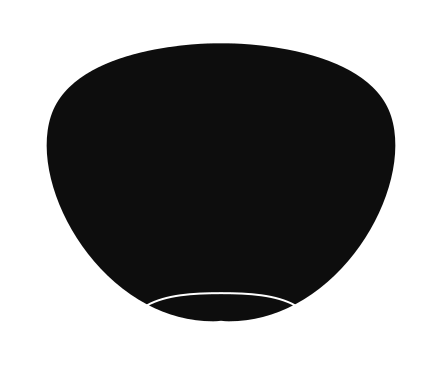

### TIYCS



**This Is Your Captain Speaking**  

### Modules

This repository contains code for:

- Driving the custom Jonisk lights (ESP32 / LED)
- Driving the custom LedBeams (ESP32 / WS2812B)
- Driving the visuals

## 2021

Code for visuals is total chaos. Used a MacBook Pro instead of Raspberry Pi's. 3 screens, 2 original views.

## 2022

### mainApp (openFrameworks)

MainApp is the app that runs on the Raspberry Pi. This will receive OSC messages to switch between states and show certain images.
To execute the program via SSH, first:  
`export DISPLAY=:0.0`  
Then run program with:  
`./bin/mainApp` (without sudo)  
The app uses ofAppGLFWWindow to be able to run fullscreen.

Planning to use a single Linux (Mint) computer, instead of seperate Raspberry Pi's. Raspberry Pi 3B+ doesn't seem to be powerful enough, and it's currently impossible to get new Raspberry Pi 4's.  

### Hardware considerations

In case of new batch:

- [ ] Check resistor in sense circuit
- [ ] Check XT60 connector male/female

#### Software

- [ ] Set PWM freq in EEPROM, high freq for picture mode, low for performance mode  
- [ ] Implement internal lag for lower framerates  

## GUI

The GUI is in SuperCollider (other repo (J_Pseudo)). 

To map the textures (projections) use:

```
t = TIYCS.new("127.0.0.1").gui;
t.mappingGui(0); // Edit window 0
```

To change the edited window press 0, 1, or 2

To change the order of the screens:

```
t.setScreenOrder(1,0,2);
```

To use the automator:

```
t.automate(); // And use the counter (button up) or MIDI
```

Other useful functions:

```
t.fullscreen();
t.gui;
```

#### Barrier

Notes using [Barrier](https://github.com/debauchee/barrier), to control Linux machine with MacBook:  
Set MacBook to server, create the screens + names.  
Set Linux as client, with matching name.  
